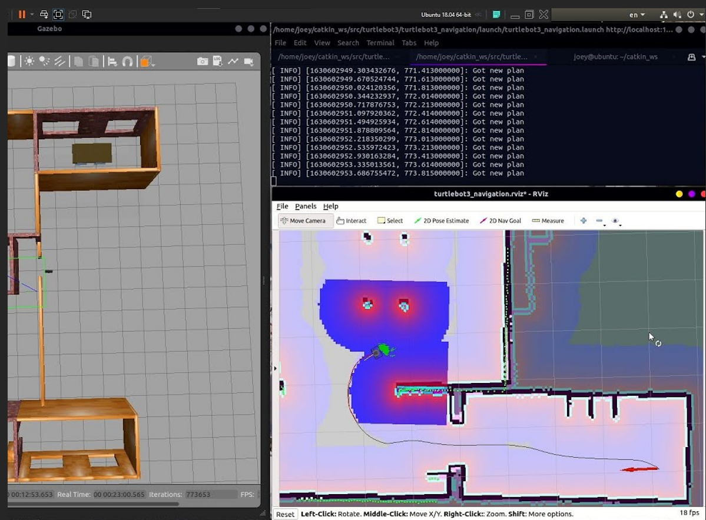

# AutoNav

## Descrizione del Progetto

AutoNav è un progetto sviluppato come parte dell'esame di Robot Programming presso l'Università degli Studi di Salerno. L'obiettivo del progetto è stato sviluppare un sistema di navigazione autonoma utilizzando ROS (Robot Operating System). Il sistema simula il movimento di un robot in un ambiente interno mappato utilizzando l'algoritmo SLAM (Simultaneous Localization and Mapping).

## Funzionalità Principali

- **Mappatura con SLAM:** Implementazione dell'algoritmo SLAM per creare una mappa dell'ambiente interno.
- **Navigazione Autonoma:** Movimento autonomo del robot all'interno di una casa con varie stanze.
- **Simulazione in Gazebo:** Utilizzo di Gazebo per simulare il movimento del robot.
- **Visualizzazione in RViz:** Utilizzo di RViz per visualizzare in tempo reale la mappa e il percorso del robot.
- **Nodi ROS e Messaggi Parametrici:** Implementazione di nodi ROS per il controllo del robot e l'invio di messaggi parametrici.

## Tecnologie Utilizzate

- **ROS (Robot Operating System):** Framework principale per lo sviluppo del sistema.
- **Gazebo:** Simulatore per testare il movimento del robot.
- **RViz:** Strumento per la visualizzazione della mappa e del percorso del robot.
- **Algoritmo SLAM:** Per la mappatura simultanea e la localizzazione del robot.
- **Nodi ROS:** Per il controllo del movimento e la gestione dei dati sensoriali.
- **Messaggi Parametrici:** Per la comunicazione tra i nodi.

## Architettura del Sistema


## Visualizzazione in Azione



## Come Eseguire il Progetto

1. **Installare ROS:**
   Seguire le istruzioni ufficiali per installare ROS sul proprio sistema.

2. **Clonare il Repository:**
   ```sh
   git clone https://github.com/username/AutoNav.git
   cd AutoNav
   seguire i comndai nella cartella project_commands
